# 博物馆智能科普系统(文末获取方式☟)
> 
#### 介绍
博物馆智能科普系统
有BUG可留言加微

#### 软件架构
Java + SSM（Spring+SpringMVC+Mybatis） + Mysql

#### 项目功能说明

1.  管理员功能
> + 用户管理：用户信息、用户数据图表
> + 文物管理：文物一览、发布文物
> + 公告管理：历史公告、发布公告
2.  用户功能
> + 登录注册
> + 首页：藏品轮播展示、公告信息展示
> + 所有藏品：藏品详情展示
> + 我的收藏
> + 个人中心：修改密码、修改个人信息

### 部分功能演示

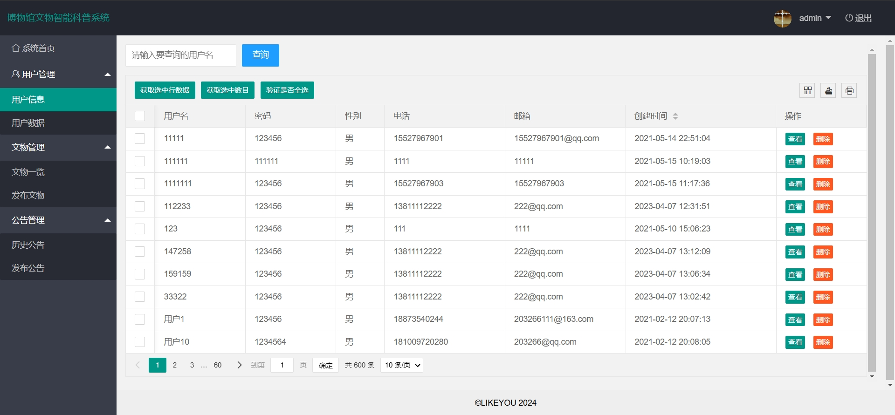
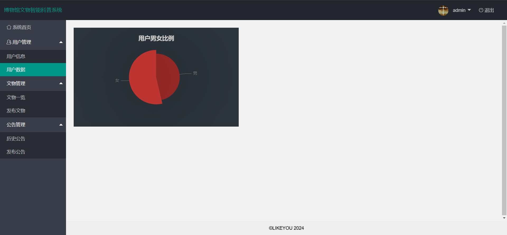
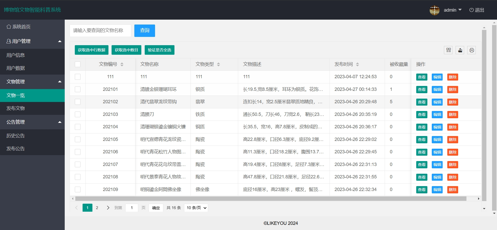
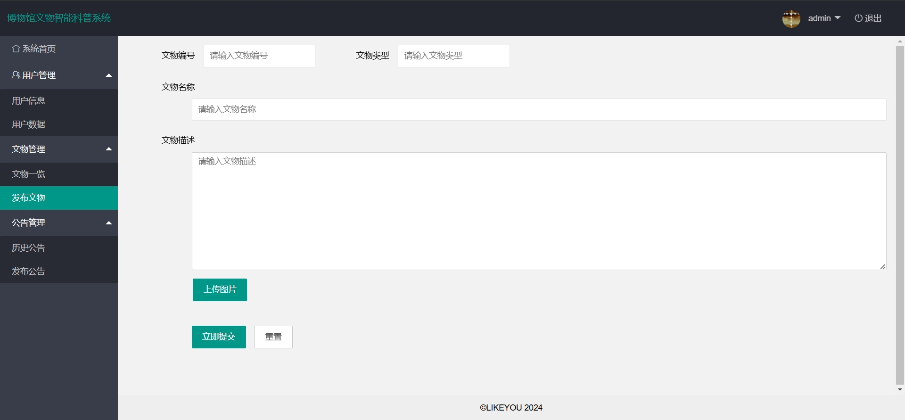
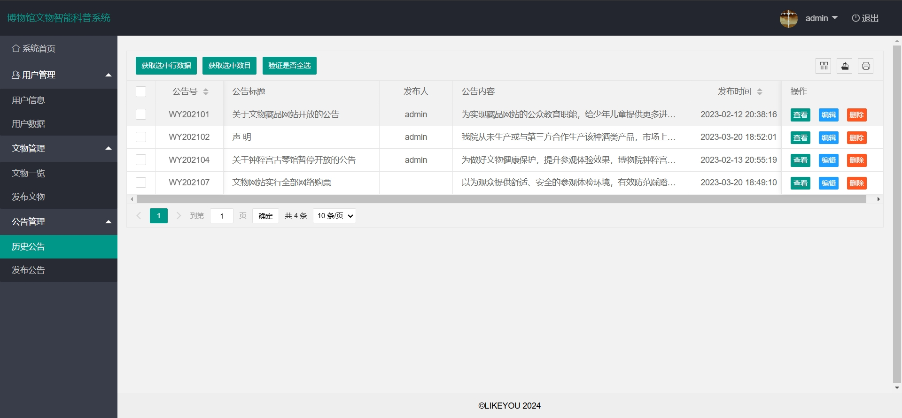
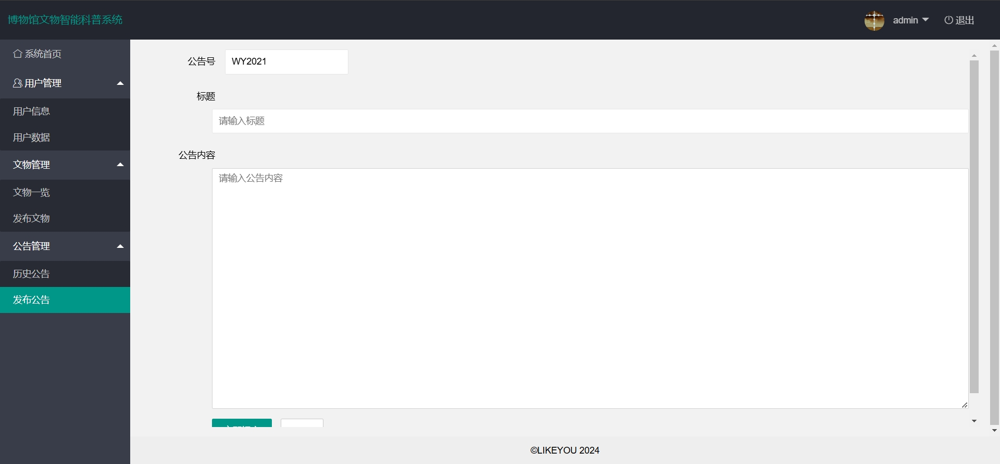
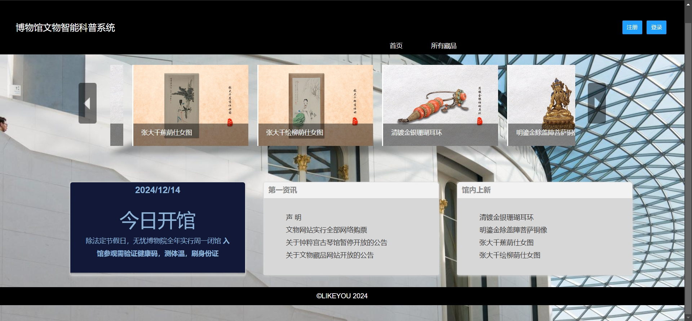
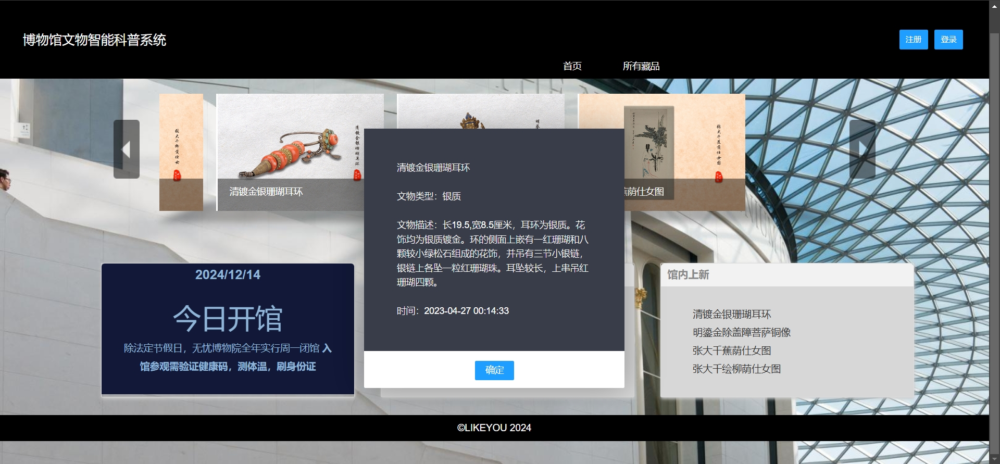
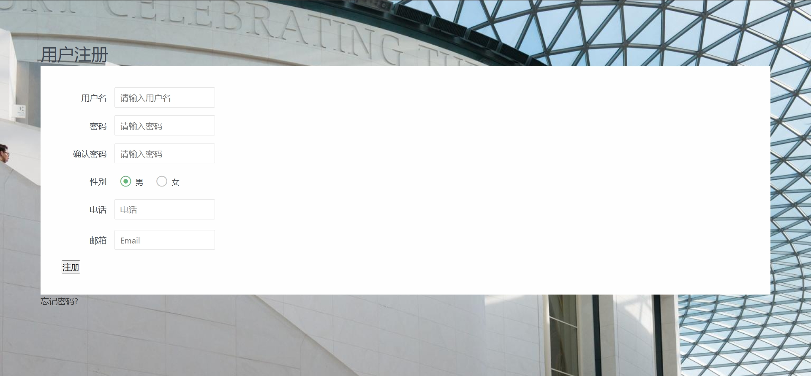
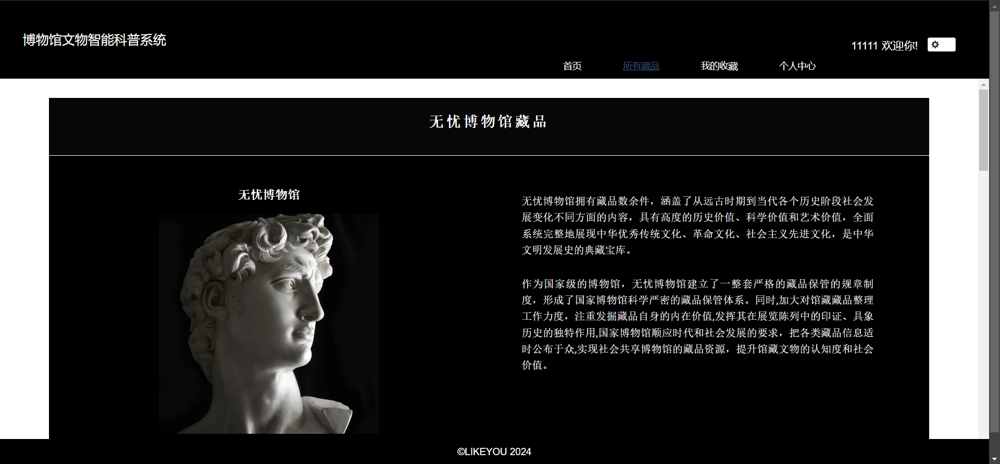
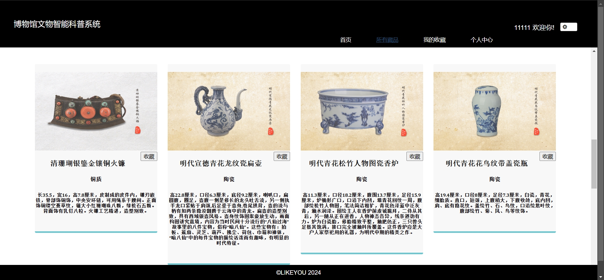
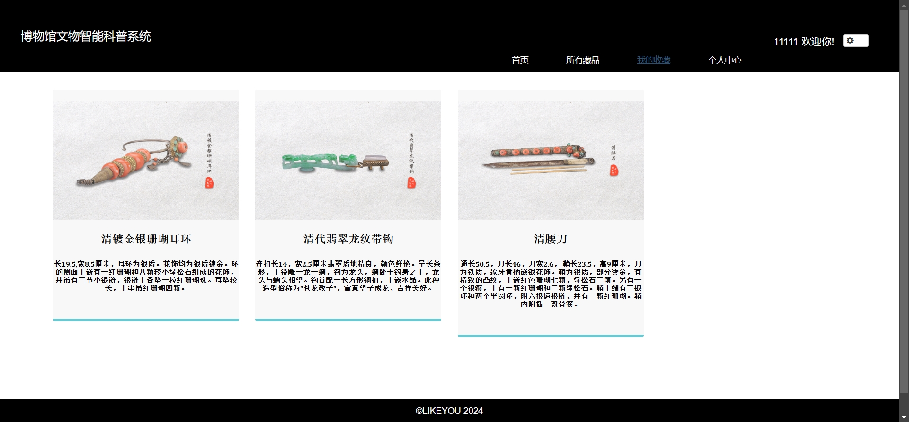
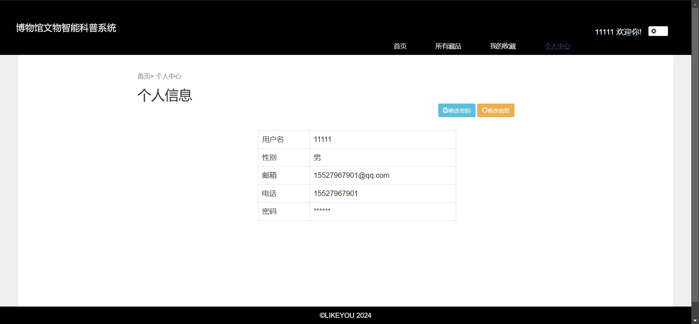

### 环境需求(可免费提供)
- idea/eclipse、jdk-1.8、maven-3.8.6、mysql、nodejs等

## 有项目修改、安装调试需求 请联系以下

## 获取资源扫☝☝☝
